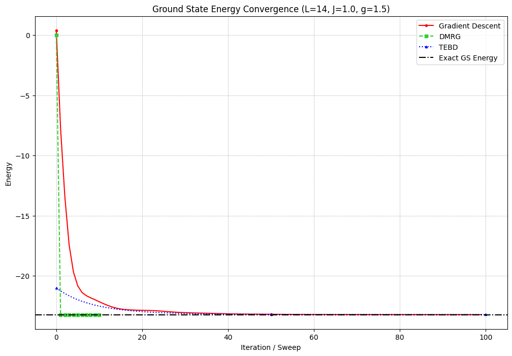
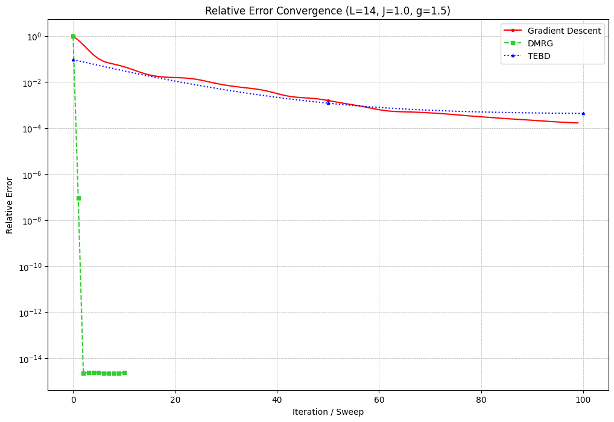

# Variational Ground State Search of the 1D Ising Model with Matrix Product States

This project explores and compares three different numerical algorithms for finding the ground state of the 1D Transverse-Field Ising Model (TFIM) using a Matrix Product State (MPS) ansatz.

The core of the project is a modern, variational approach that uses **gradient descent** to optimize the MPS tensors. This is made possible by implementing the MPS and Hamiltonian in **PyTorch**, which allows for the use of its powerful automatic differentiation capabilities.

For benchmarking, the performance of the gradient descent method is compared against two highly-established, state-of-the-art tensor network algorithms:
1.  **Density Matrix Renormalization Group (DMRG)**
2.  **Time-Evolving Block Decimation (TEBD)** for imaginary time evolution

## Key Results

The simulations clearly demonstrate the superior efficiency and accuracy of DMRG for this class of problems. While gradient descent successfully converges to the ground state, it requires significantly more iterations and achieves a lower final precision compared to the specialized, physically-motivated updates of DMRG and TEBD.

#### Ground State Energy Convergence


#### Relative Error Convergence


## Project Structure

The repository is organized into several Python modules and a main Jupyter Notebook for running the experiments.

-   `a_mps_torch.py`: Contains the `MPS` class implemented in PyTorch. It includes methods for initialization, calculating expectation values, norms, and the core `split_truncate_theta` function for SVD.
-   `b_model_torch.py`: Contains the `TFIModel` class, which constructs the Transverse-Field Ising Hamiltonian as both a sum of bond operators (for TEBD) and as a Matrix Product Operator (MPO) for DMRG and gradient descent.
-   `c_tebd_torch.py`: A PyTorch implementation of the TEBD algorithm for imaginary time evolution.
-   `d_dmrg_torch.py`: An adaptation of the DMRG algorithm that uses a NumPy/SciPy core to operate on the PyTorch `MPS` object. This provides a stable and correct benchmark.
-   `tfi_exact.py`: A helper module to compute the exact ground state energy for small systems using exact diagonalization.
-   `gradient_descent.ipynb`: A Jupyter Notebook that serves as the main entry point. It imports the necessary modules, runs the three algorithms, and generates the comparison plots.

## Setup and Installation

It is recommended to use a virtual environment (e.g., with `conda` or `venv`).

1.  **Clone the repository:**
    ```bash
    git clone <your-repo-url>
    cd <your-repo-name>
    ```

2.  **Install dependencies:**
    The main dependencies are PyTorch, NumPy, SciPy, and Matplotlib. You can install them using pip:
    ```bash
    pip install torch numpy scipy matplotlib jupyter
    ```
    Or, if using conda:
    ```bash
    conda install pytorch numpy scipy matplotlib jupyter -c pytorch
    ```

## Usage

All experiments are run from the `Main.ipynb` Jupyter Notebook.

1.  **Launch Jupyter:**
    ```bash
    jupyter notebook
    ```
2.  **Open `gradient_descent.ipynb`:** Open the notebook in your browser.
3.  **Run the cells:** The notebook is structured to be run sequentially. It will:
    * Initialize the model parameters (L, J, g).
    * Compute the exact theoretical ground state energy.
    * Initialize a random MPS to be used as a common starting point for DMRG and Gradient Descent.
    * Run the `run_dmrg` function.
    * Run the `run_tebd` function.
    * Run the `run_gradient_descent` function.
    * Generate and display the final comparison plots.

You can easily modify the parameters in the notebook to explore different physical regimes or algorithm settings.

